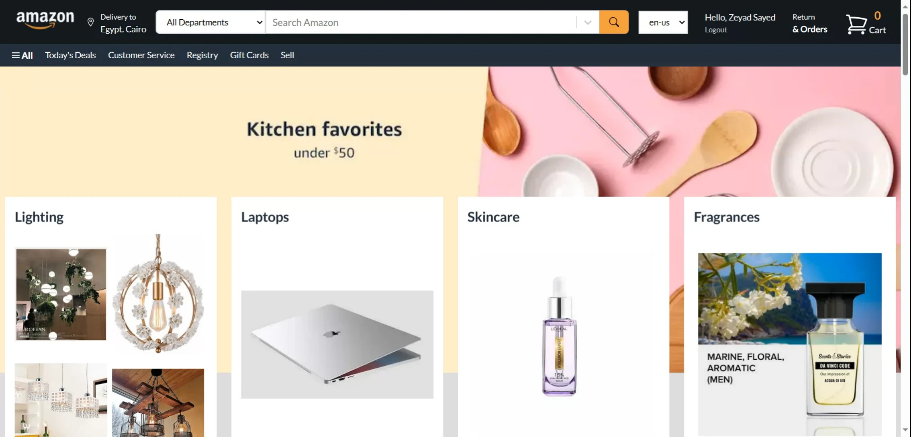

# Amazon-Clone Project

## Description

The Amazon-clone project is a streamlined web application replicating the fundamental features of Amazon. Users can easily browse products, add them to a cart 🛒, and seamlessly proceed to checkout. This project serves as a hands-on learning experience for me 💻, allowing me to enhance my skills in both front-end and back-end development. By integrating payment gateways, I gained valuable insights into the complexities of building a comprehensive e-commerce site 🌐.

## Features

List of the main features of Amazon-Clone:

- User authentication and authorization
- Shopping cart and checkout functionality
- Product search and filtering
- Product reviews and ratings
- Payment integration with Stripe
- Return Orders and orders history
- Categories Filters by price, rating, brand and more

## Technologies

Mention the technologies and tools you used to create your project, such as:

- Next
- React
- Typescript
- MongoDB
- Node
- Express
- Tailwind CSS
- Axios
- Stripe
- Json Web Tokens

## Installation

Steps to install and run the project locally:

- Clone the repository: `git clone https://github.com/your-username/amazon-clone.git`
- Install the dependencies: `npm install` then go to the server file and do it again
- Start the client: `npm run dev`
- Start the server: go to server file and then `npm start`
- Open http://localhost:3000 in your browser

## Demo

Screenshots of the pages and a link to a live demo, also a link to server status page.

Visit [Live Demo](https://amazon-clone-24.netlify.app/)
 
Visit [Status Page](https://stats.uptimerobot.com/MPpo3txRM4)

## License

This project is licensed under the [MIT License](https://choosealicense.com/licenses/mit/). See the [LICENSE](./LICENSE.txt) file for details.
